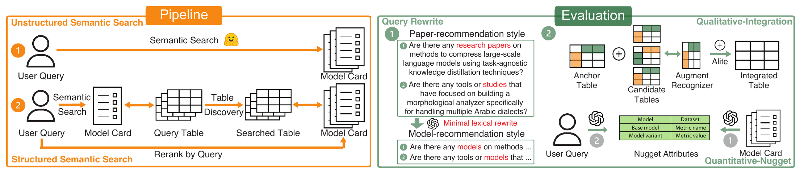
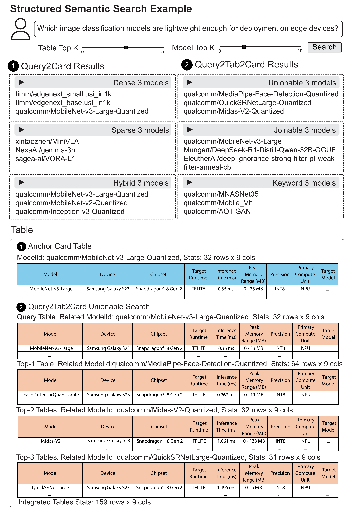
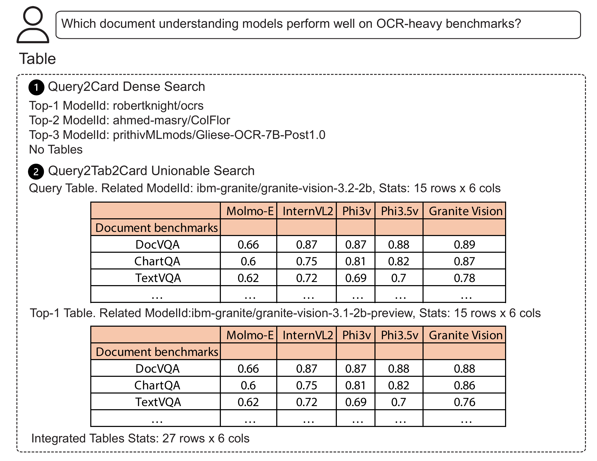

# ModelSearch Demo

Official implementation of the paper *[Diversed Model Discovery via Structured Table Discovery](https://arxiv.org/abs/2605.22766)*.

<p align="center">
  
</p>

ModelSearch is a demo for model-card retrieval, query-to-table-to-model retrieval, and table integration over retrieved CSV tables. The current codebase is centered on the Flask demo in `src/demo/`, retrieval in `src/search/`, integration in `src/integration/`, and evaluation in `src/evaluate/`.

## Abstract

Model cards describe the behavior of models through a mixture of textual descriptions and structured artifacts, including performance, configuration, and dataset tables. Existing model search systems rely predominantly on semantic similarity over text, which can produce homogeneous result sets and limit users' ability to explore alternatives and reason about trade-offs. We argue that model search is inherently comparative: users want models that are aligned at the task level yet differentiated in measurable ways.

ModelSearch is a table-driven model search framework built on the curated ModelTables benchmark. Given a query, ModelSearch combines a semantic baseline for task alignment with a structure-aware pipeline that discovers query-related model-card tables using table discovery operators such as unionability, joinability, and keyword search. Retrieved tables are mapped back to model cards under a controlled top-`k` budget, enabling fair comparison between text-based and table-based retrieval. Beyond retrieval, ModelSearch adapts table integration to the model-table domain through orientation-aware and iterative consolidation, producing compact comparison views from partially overlapping and sometimes transposed evidence tables.

For evaluation, ModelSearch uses a nugget-based, auditable protocol that extracts compact evidence items from model cards, matches queries to condition- or intent-specific nuggets, and measures evidence coverage and diversity over retrieved model-card candidate sets. This repository also provides an interactive demo exposing retrieval, inspection, and integration functionality.

## Data

The ModelTables benchmark data is not bundled in this repository. Download the tables from the ModelTables Google Drive folders and place or link the data so it matches the paths in `src/config.py`.

- [Full Dataset](https://drive.google.com/drive/folders/1YLfkknrFuE9pWFJuarb4kyX1o5NtN-Y8?usp=sharing): complete dataset with processed tables, ground-truth files, and intermediate results.
- [Updated Tables](https://drive.google.com/drive/folders/1f2tXNLcl0Dfi88DNhAD2R655dOBwOzb8?usp=drive_link): processed tables from the newer dump snapshot.
- [ModelTables GitHub](https://github.com/RJMillerLab/ModelTables): source benchmark repository and data-generation context.

## Quick Start

1. Download the necessary data and repositories.

- Install Python dependencies from `requirements.txt`.
- Prepare the local data used by [src/config.py](src/config.py), especially ModelTables data.
- Download or link the external repositories used by this project, especially `Blend_internal` and `alite_internal`.
- Install extra retrieval dependencies when needed, especially `faiss` and `pyserini` with Java.

Detailed build and data-prep notes are in [docs/build_index.md](docs/build_index.md).

2. Start the demo.

```bash
python -m src.demo.backend
python -m src.demo.frontend
```

Then open `http://localhost:5001`.

## Docs

- [docs/build_index.md](docs/build_index.md) covers data preparation and index building.
- [src/query/README.md](src/query/README.md) covers query sources, rewriting, and labeling.
- [src/evaluate/README.md](src/evaluate/README.md) covers nugget extraction, query-to-nugget mapping, and evaluation scripts.
- [src/batch_exp/README.md](src/batch_exp/README.md) covers the batch benchmark experiment for query-to-model-card nugget evaluation.

## Demo

<p align="center">
  
</p>

<p align="center">
  
</p>

## Acknowledgments

This demo builds on several external tools and codebases:

- [Pyserini](https://github.com/castorini/pyserini) for sparse / Lucene-based retrieval
- [FAISS](https://github.com/facebookresearch/faiss) for dense vector search
- [Blend](https://github.com/DoraDong-2023/Blend_internal) for table search
- [ALITE](https://github.com/northeastern-datalab/alite) for table integration
- [ModelTables](https://github.com/RJMillerLab/ModelTables) for the underlying data pipeline and datasets
