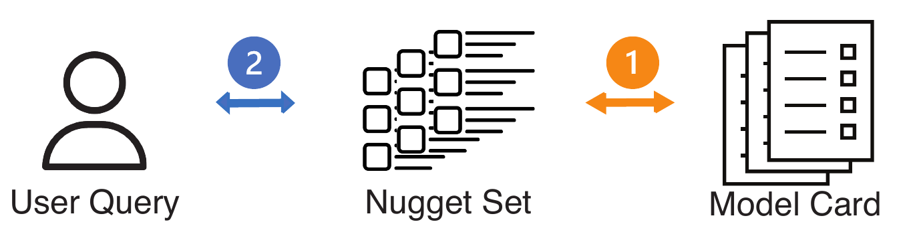

# Evaluate



## Content

1. [Model Card Extract Nuggets](#1-model-card-extract-nuggets)
2. [Get Query-Nuggets List Mapping](#2-get-query-nuggets-list-mapping)
3. [Evaluate](#3-evaluate)

## 1. Model Card Extract Nuggets

```bash
python -m src.evaluate.card2nugget_extraction --model-ids-file data_251117/query/toy_data/model_ids.txt
```

Writes per-model CSV + meta under `data_251117/card2nugget/`. Batch API request / response jsonl files stay under `data_251117/evaluate/batch/`. If Batch stalls, add `--llm-mode iter` for sync chat per model.

## 2. Query → nugget schema headers (LLM)

After step 1, map queries (default: OpenAI Batch) and optionally build `qrels` / `.run` from the CSVs under `data_251117/card2nugget/`. Use `--llm-mode iter` for sync chat per query if Batch stalls.

```bash
python -m src.evaluate.query2nugget_mapping --queries-file data_251117/query/toy_data/queries.txt --build-qrels-run
```

Writes `query_header_keyword_mapping.json`, `real_subtopic.qrels`, `real_initial.run`, and `query_csv_match_debug.json` under `data_251117/evaluate/` by default.

End-to-end wrap from `jobs_251117` batch JSON (card2nugget -> query2nugget -> per-method eval under one job; outputs under `data_251117/evaluate/pipeline/`):

```bash
python -m src.evaluate.wrap_card_query_eval \
  --jobs-json jobs_251117/batch_runs/batch_preset_queries_20260330_025232.json \
  --job-id 2026-03-30_02-49-47_svsq 2026-03-30_02-49-56_b3a3 \
  --llm-mode iter

# Run all job ids from the same batch JSON:

python -m src.evaluate.wrap_card_query_eval \
  --jobs-json jobs_251117/batch_runs/batch_preset_queries_20260330_025232.json \
  --all-job-ids \
  --llm-mode iter
```

## 2. Batch Run (two sources only: preset + extra)

Batch-run backend search/integration, then automatically run `wrap_card_query_eval` on saved jobs.
Default source is `all` (preset + extra).

```bash
python -m src.utils.batch_run_preset_queries \
  --backend_url http://localhost:5002 \
  --preset_path docs/preset_queries.json \
  --extra_queries_path data_251117/query/query_rewrite_polished.jsonl \
  --query_source all \
  --run_integration \
  --run_wrap_eval \
  --wrap_llm_mode iter
```

Switch source if needed:
- `--query_source preset` (UI preset source)
- `--query_source extra` (batch extra source)
- `--query_source all` (both; default)

Wrap / §3 need `pyndeval`: `pip install pyndeval` (see `requirements.txt`).

## 3. Evaluate (pyndeval)

```bash
python -m src.evaluate.evaluate_pyndeval \
  --run data_251117/evaluate/pipeline/2026-03-30_02-49-47_svsq/2026-03-30_02-49-47_svsq_dense_real_initial.run \
  --qrels data_251117/evaluate/pipeline/2026-03-30_02-49-47_svsq/2026-03-30_02-49-47_svsq_dense_real_subtopic.qrels \
  --cutoff 20
```
For wrap runs, use the per-method `.run` / `.qrels` paths under `data_251117/evaluate/pipeline/<job_id_dir>/`.

Compare `keyword/single_column/unionable` vs `sparse/dense/hybrid` across a whole batch jobs JSON:

```bash
python -m src.evaluate.compare_method_families \
  --jobs-json jobs_251117/batch_runs/batch_preset_queries_20260330_025232.json
```

